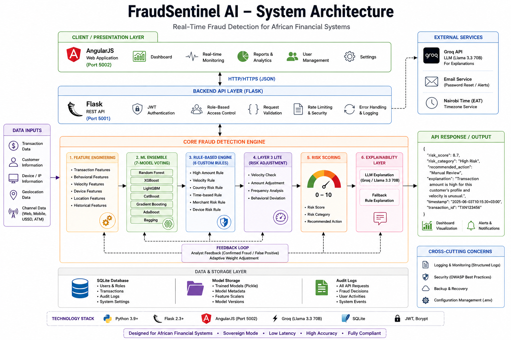
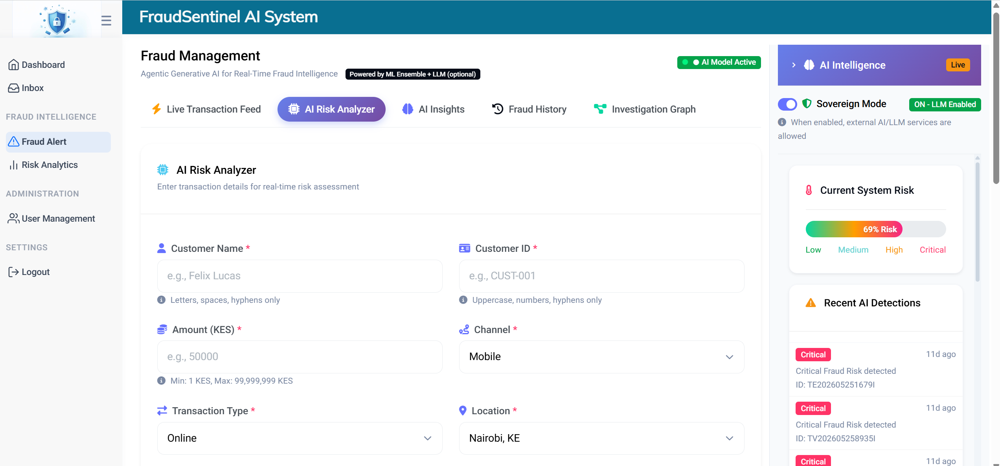
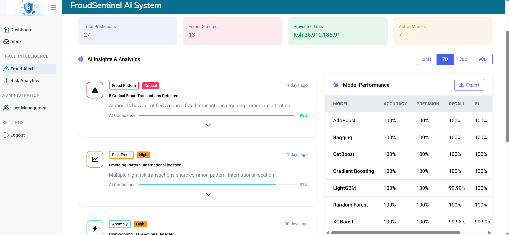
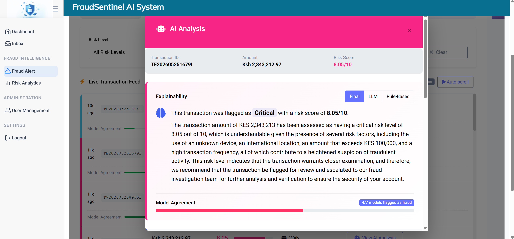
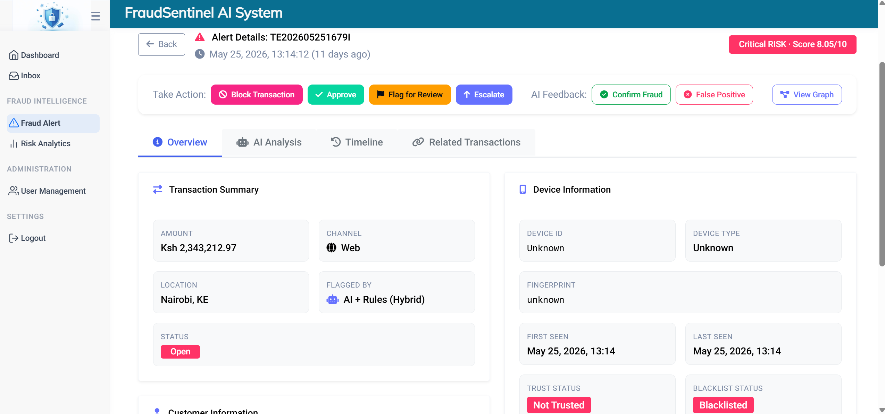
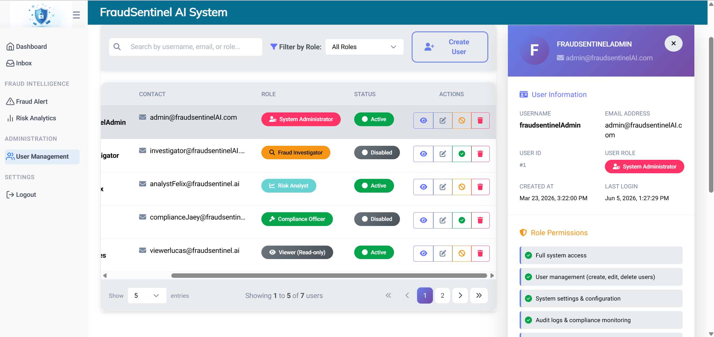

# FraudSentinel AI
### Real-Time Fraud Detection for African Financial Systems

[](https://python.org)
[](https://flask.palletsprojects.com)
[](LICENSE)
[](http://makeapullrequest.com)

### Related Repositories

- [Frontend](https://github.com/SayiaFelix/fraudGuard.git)
- [Backend](https://github.com/SayiaFelix/finGuardAI.git)

> **BeOrchid Africa Hackathon 2026 - Top 30 Finalist** 🏆

## Beorchid Africa Developers Hackathon 2026

FraudSentinel AI is a production-ready fraud detection system designed specifically for African financial institutions. The project focuses on leveraging Artificial Intelligence to improve fraud detection, risk assessment, and financial security across African institutions. It combines a 7-model ensemble machine learning approach with rule-based detection, providing real-time risk scoring with sub-200ms latency.

### Table of Contents

- [Problem Statement](#problem-statement)
- [System Architecture](#system-architecture)
- [Portal Screenshots](#portal-screenshots)
- [Demo Video](#demo-video)
- [Features](#features)
- [How FraudSentinel AI Meets Stage 3 Criteria](#how-fraudsentinel-ai-meets-stage-3-criteria)
- [Quick Start](#quick-start)
- [Test Credentials](#test-credentials)
- [Team](#team)

## Problem Statement

Across Africa, rapid growth in mobile money, digital lending, and online banking has significantly increased financial inclusion but also expanded the fraud attack surface. Platforms such as M-Pesa, MTN MoMo, and OPay process millions of daily transactions.

Financial institutions face evolving fraud tactics including synthetic identity fraud, SIM-swap attacks, account takeover, and coordinated fraud rings. Traditional rule-based systems generate high false-positive rates, react after financial loss occurs, and lack explainability for regulators.

**FraudSentinel AI** combines machine learning (7-model ensemble), rule-based detection, adaptive feedback, and LLM-powered explainability to provide accurate, transparent, and scalable fraud detection built specifically for Africa's digital finance ecosystem.


### Project Status

 - MVP Completed  
 - Backend API Completed  
 - Fraud Detection Engine Completed  
 - Explainability Layer Integrated  
 - Ready for Stage 3 Evaluation

## System Architecture


### Layer 1: Client Layer
- **AngularJS** frontend (Port 5002)
- Dashboard, real-time monitoring, user management

### Layer 2: API Gateway (Flask, Port 5001)
- JWT Authentication + RBAC
- Rate limiting & request validation

### Layer 3: Fraud Detection Engine
| Component | Details |
|-----------|---------|
| Feature Engineering | Transaction, behavioral, velocity, device, location features |
| 7-Model Ensemble | Random Forest, XGBoost, LightGBM, CatBoost, Gradient Boosting, AdaBoost, Bagging |
| Rule-Based Engine | High amount, velocity, country risk, time-based, merchant risk, device risk |
| Layer 3 Lite | Velocity check, amount adjustment, frequency analysis |
| Risk Scoring | Score (0-10) + Category + Recommended Action |
| Explainability | Groq LLM (Llama 3.3) with rule-based fallback |

### Layer 4: Storage
- SQLite (users, transactions, audit logs)
- Pickle (trained models, scalers, weights)

### Cross-Cutting
- Sovereign Mode (data stays in Africa)
- Audit logging for all decisions
- Feedback loop for adaptive learning

*High-level architecture of the FraudSentinel AI fraud detection system*


## Portal Screenshots

| Login Page | Dashboard |
|------------|-----------|
|  |  |

| Risk Analyzer | AI Insights |
|---------------|----------------|
|  |  |

| Live Transaction | Transaction Detail |
|---------------------|-----------------|
|  |  |

| Fraud History | Fraud Details |
|---------------------|-----------------|
|  |  |

| User Management | User Detail |
|---------------------|-----------------|
|  |  |


## Demo Video

**Watch the full walkthrough (5 minutes):** [FraudSentinel AI Demo](https://youtu.be/YOUR_VIDEO_ID)

The demo covers,
- Real-time fraud detection API calls
- Dashboard walkthrough
- Risk analyzer demonstration
- Feedback loop showing adaptive learning
- LLM explanation generation

**Deployed Live Link** 

- [FraudSentinel AI Portal](http://130.61.111.65:5002)
- [Backend APIs](http://130.61.111.65:5001/v1/api/)

<!-- - **Frontend:** `http://130.61.111.65:5002`
- **Backend API:** `http://130.61.111.65:5001/v1/api/` -->

> *Note: The live demo may be temporarily unavailable during active development or server maintenance.*


## API Usage Examples

### Submit a Transaction for Risk Scoring | Request

#### curl Command

```bash
curl -X POST http://localhost:5001/v1/api/real_time_risk_score \
  -H "Content-Type: application/json" \
  -H "Authorization: Bearer YOUR_JWT_TOKEN" \
  -d '{
    "Transaction_Amount": 250000,
    "Device_Type": "Unknown_Device",
    "Transaction_Type": "Online",
    "Transaction_Location": "International",
    "IP_Address": "45.67.89.10"
  }'

```

### Response

```json

{
  "status": "success",
  "result": {
    "risk_score": 8.7,
    "risk_category": "High Potential Fraud",
    "recommended_action": "Flag for review",
    "explanations": {
      "final": "Transaction flagged due to 4x normal transaction frequency and shared device with 3 previously flagged accounts. Risk Score: 0.87. Recommended action: Step-up authentication or temporary hold..",
      "llm": "Transaction flagged due to 4x normal transaction frequency and shared device with 3 previously flagged accounts. Risk Score: 0.87. Recommended action: Step-up authentication or temporary hold...",
      "rule_based": "This transaction of KES 250,000 shows patterns consistent with fraudulent activity..."
    }
  }
}

```

## Features

### Fraud Detection Engine
- **7-Model Ensemble** - Random Forest, XGBoost, LightGBM, CatBoost, Gradient Boosting, AdaBoost, Bagging
- **Rule-Based Engine** - 6 custom rules for known fraud patterns
- **Self-Learning** - Feedback loop adapts weights based on analyst input
- **Layer 3 Lite** - Real-time risk adjustment with velocity checks

### Security & Compliance
- **JWT Authentication** - Secure token-based API access
- **Role-Based Access Control** - Admin, Analyst, Investigator, Compliance, Viewer
- **Sovereign Mode** - Data never leaves Africa
- **Audit Log** - Complete transaction history

### API Endpoints
- **Authentication** - Login, Refresh token
- **User Management** - Full CRUD operations
- **Fraud Detection** - Real-time scoring, transaction history
- **Admin Controls** - User management, system settings

###  African Context
- **KES Currency** - Kenyan Shilling support
- **Nairobi Timezone** - All timestamps in EAT
- **Local Rules** - Custom rules for African fraud patterns
- **Low Latency** - Optimized for African network conditions

### Explainable AI
- **LLM-Powered Explanations** - Customer-friendly fraud explanations (Groq/Llama)
- **Rule-Based Fallback** - Always have explanations even without LLM
- **Transparent Decisions** - Clear reasoning for each risk score

###  User Management
- **Full CRUD Operations** - Create, read, update, delete users
- **Role Management** - Assign and update user roles
- **Password Reset** - Email reset or temporary password generation
- **Account Management** - Enable/disable user accounts


## How FraudSentinel AI Meets Stage 3 Criteria

| Criterion | Our Implementation |
|-----------|-------------------|
| **Technical Execution (Coded MVP)** | 15+ Flask API endpoints, 7 working ML models, dual storage (pickle + SQLite) |
| **Core AI Integration** | Real-time ensemble scoring + Groq LLM explanations with fallback |
| **Simplicity & Architecture** | Modular: `auth/`, `database/`, `cache/` with clean separation |
| **Perseverance & Progress** | Adaptive weights learning from feedback, full audit trail |


## Quick Start

### Prerequisites
- Python 3.9+
- Git


## Installation

### Backend setup

### 1. Clone the repository
```bash
git clone https://github.com/SayiaFelix/finGuardAI.git
cd development
```

### 2. Install dependencies

```bash
pip install -r requirements.txt
```
### 3. Configure environment variables

```bash
cp .env.example .env
# Edit .env with your Groq API key (optional)
```

### 4. Run the server

```bash
python fin_guard_ai.py
```

## Test Credentials

After running the server, use these credentials to authenticate

| Role | Email | Password |
|------|-------|----------|
| Admin | admin@fraudsentinel.com | admin@123 |
| Analyst | analyst@fraudsentinel.com | analyst@123 |

💡 **Quick Demo Access:** Click the button on the right side of the login form to auto-fill Admin credentials, then press **Login**.

*Run `python fin_guard_ai.py` first to create these users*

## Team

### Team Lead
- Felix Sayia

### Project
- FraudSentinel AI

### Event
- Beorchid Africa Developers Hackathon 2026